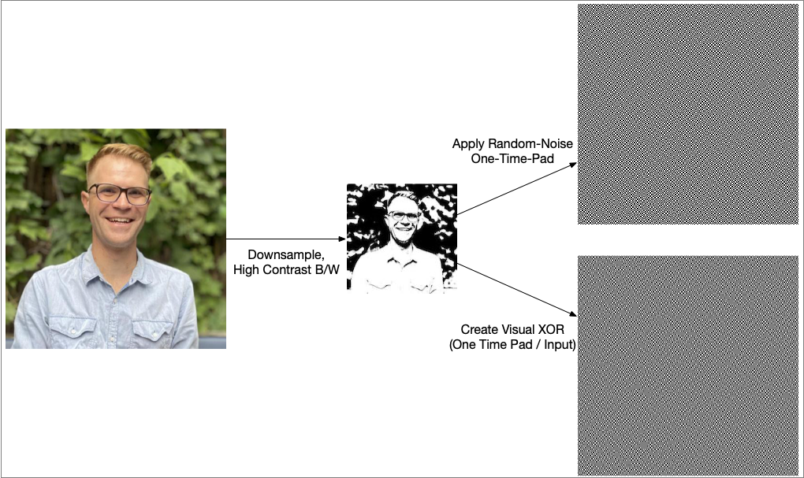
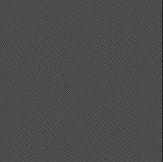
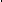
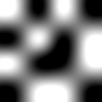
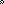
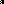

# Visu Crypt

Visual XOR based encryption with random one time pads.


## About

[Visual Cryptography](https://en.wikipedia.org/wiki/Visual_cryptography) is an approach to split information over image shares, where:
 * Every share by itself leaves no information about the content.
 * An image superposition (images printed on foil, stacked arrangement) reveals the original secret.
 
This repository hosts an open source implementation.

## Illustrations

 * The software first creates a downsampled, black&white abstraction of the input image. 
 * Then it generates a random One-Time-Pad (OTP) and applies it to the abstraction to create two visual shares.  

 * Perfect alignment of shares reveals the secret, while any other superposition tells nothing about the original.  


 > One Time Pads hide a secret with random entropy. Decryption is not a question of computational power. Holding only one share, the set of potential outcomes is any possible image.

## Algorithm

Imagine a [2x2 test image](src/test/resources/test-image.png):  


Running this library will create a random one time pad and apply it to the test image. This results in two more images, which serve as secret shares:

 * [Image 1: Stems from the One-Time-Pad](markdown-samples/sample-share1.png):  
 
 * [Image 2: Stems from the XOR combination of test image and One-Time-Pad](markdown-samples/sample-share2.png):  
 
 
 The logical NOR operation of above shares (which corresponds to visual XOR, because the human eye interprets dithered areas as brighter) results in a [visual decryption of the original image (secret)](markdown-samples/overlay.png):  
 


## Documentation

See [JavaDoc on GitHub pages](https://kartoffelquadrat.github.io/VisuCrypt/).

## Usage

 * Compile the sources: ```mvn clean package```
 * Run the program: ```java -jar target/VisuCrypt.jar path/to/source/image.jpg``` or  
 ```mvn clean package exec:java -Dexec.args=path/to/source/image.jpg```
 * Print shares, generated next to source image as ```share1.png```, ```share2.png```.
 * Place printed shares one on top of the other, hold against a light source.

## License

[MIT](LICENSE)

## Author

Maximilian Schiedermeier, 2018 - 2022  
At the time employed at [INSA Lyon, LIRIS Labs](https://liris.cnrs.fr/page-membre/maximilian-schiedermeier).
